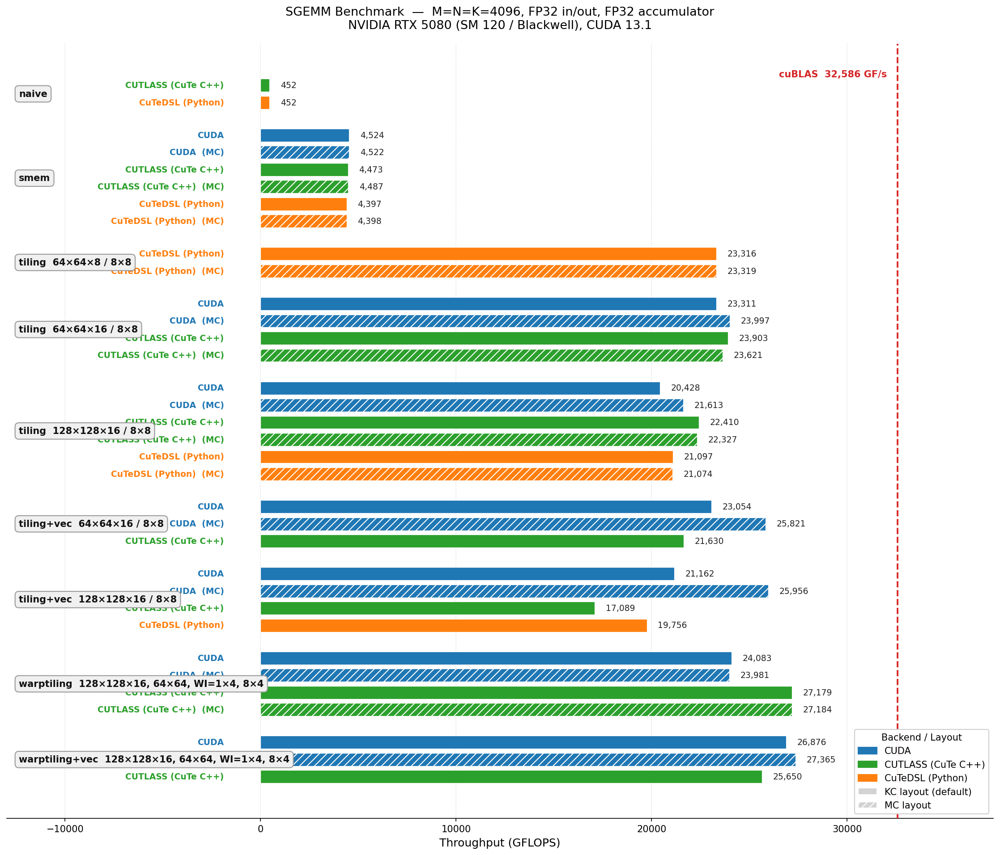

# cutlass-cute-playground

SGEMM (and FlashAttention) kernels written three ways on an RTX 5080, benchmarked against cuBLAS:

1. **CUDA** — raw, row-major
2. **CUTLASS** — CuTe C++, column-major
3. **CuTeDSL** — Python DSL via `nvidia-cutlass-dsl`

## Results

`D = alpha · Aᵀ · B + beta · C`, FP32, M = N = K = 4096, RTX 5080 (SM 120), CUDA 13.1:



Highlights:

- **`warptiling` wins** — hierarchical warp→subtile→thread tiling is the main step up from register tiling.
- **`warptiling_vec` is slower than `warptiling`** — vectorized 128-bit g2s copies force disabling the smem swizzle, and the resulting bank conflicts outweigh the bandwidth gain.
- **CuTeDSL is close to CUTLASS where it works** (~10% overhead), but is missing two kernel families due to upstream bugs.

## Layout

```
CUDA/sgemm/        # raw CUDA (.cuh + instantiate.cu)
CUTLASS/sgemm/     # CuTe C++ (.cuh + instantiate.cu)
CuTeDSL/sgemm/     # Python DSL (.py + instantiate.py)
bench_sgemm.py     # cuBLAS vs CUDA vs CUTLASS vs CuTeDSL
check_sgemm.py     # correctness vs cuBLAS
plot_sgemm.py      # run bench + render grouped bar chart → bench_results/
```

`mc` variants use M-contiguous smem for `As`; default is K-contiguous.

## Build & run

```bash
make build                              # build both shared libs
python bench_sgemm.py --size 4096       # benchmark
python check_sgemm.py                   # correctness check
python plot_sgemm.py --size 4096        # save plot to bench_results/
```

Dependencies: CUTLASS headers at `/usr/local/cutlass`, `nvidia-cutlass-dsl`, `cupy`, `cuda-python`, cuBLAS.

## Known CuTeDSL bugs

- [NVIDIA/cutlass#3159](https://github.com/NVIDIA/cutlass/issues/3159) — `make_tiled_mma` crashes on hierarchical thread layouts, blocking warptiling in the Python DSL.
- [NVIDIA/cutlass#3160](https://github.com/NVIDIA/cutlass/issues/3160) — `tiled_copy` to a swizzled `ComposedLayout` produces wrong results when `CPY_K > 1`.
